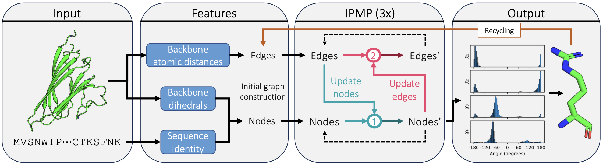

# PIPPack
Implementation of Protein Invariant Point Packer (PIPPack)

PIPPack is a graph neural network (GNN) that utilizes geometry-aware invariant point message passing (IPMP) updates and recycling to rapidly generate accurate protein side chains. Check out the [preprint](https://www.biorxiv.org/content/10.1101/2023.08.03.551328v1) on bioRxiv!


## Quickstart
To get started right in your browser, click this button to open the PIPPack notebook in Google Colab:
[](https://colab.research.google.com/github/Kuhlman-Lab/PIPPack/blob/main/notebooks/PIPPack.ipynb)

Note that this notebook is still a WIP, with a number of features still to be implemented.

## Getting started
To build the environment from scratch:
```
# Create and activate the pippack environment
conda create -n pippack
conda activate pippack

# Install PyTorch (see https://pytorch.org/get-started/locally/)
conda install pytorch torchvision torchaudio pytorch-cuda=11.8 -c pytorch -c nvidia

# Install Lightning (see https://lightning.ai/docs/pytorch/stable/starter/installation.html)
conda install lightning=2.0.1 -c conda-forge

# Pip installs:
#  - PyTorch Geometric (see https://pytorch-geometric.readthedocs.io/en/latest/install/installation.html) 
#  - BioPython (see https://biopython.org/wiki/Download)
#  - Hydra (see https://hydra.cc/docs/intro/#installation)
python -m pip install torch-geometric biopython hydra-core -U
```

Alternatively, you can use the environment file `env/pippack_env.yaml` to build the environment:
```
# Build pippack environment from yaml file
conda env create -f env/pippack_env.yaml
```

## License
This project is licensed under the MIT License - see the [LICENSE](LICENSE) file for details.

## Citation
If you find PIPPack useful in your research or project, please cite our paper:
```
@article{randolph2023pippack,
  title={Invariant point message passing for protein side chain packing and design},
  author={Randolph, Nicholas and Kuhlman, Brian},
  journal={bioRxiv preprint bioRxiv:10.1101/2023.08.03.551328 },
  year={2023}
}
```
